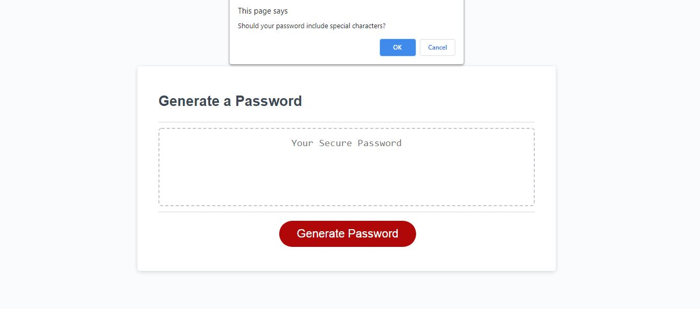

# Password Generator

## Description: 
In a world full of cyber threats, having a secure password is vital. This password generator was created to allow people to generate safe and secure passwords! 

* [Technology](#technology)
* [Deployment](#deployment)
* [Usage](#usage)
* [Story](#story)
* [Questions](#questions)
* [License](#license)

## Technology

## Deployment
Deployed Link: https://stephgeorge22.github.io/password-generator/

## Usage
Once the "Generate Password" button is clicked, the application will then prompt for the password length, whether or not it should include lowercase letters, uppercase letters, numerical values and special characters. Once the prompts are complete, a secure password will be generated. 

## Story
AS AN employee with access to sensitive data  
I WANT to randomly generate a password that meets certain criteria  
SO THAT I can create a strong password that provides greater security  

## Acceptance Criteria:
GIVEN I need a new, secure password  
WHEN I click the button to generate a password  
THEN I am presented with a series of prompts for password criteria  
WHEN prompted for password criteria  
THEN I select which criteria to include in the password  
WHEN prompted for the length of the password  
THEN I choose a length of at least 8 characters and no more than 128 characters  
WHEN prompted for character types to include in the password  
THEN I choose lowercase, uppercase, numeric, and/or special characters  
WHEN I answer each prompt  
THEN my input should be validated and at least one character type should be selected  
WHEN all prompts are answered  
THEN a password is generated that matches the selected criteria  
WHEN the password is generated  
THEN the password is either displayed in an alert or written to the page  

## Questions
Hi, I'm Stephanie. If you like my work and want to connect please feel free to reach out!

Github: www.github.com/stephgeorge22
Email: stephanie.george22@gmail.com

## License 

Copyright 2021 stephgeorge22

Permission is hereby granted, free of charge, to any person obtaining a copy of this software and associated documentation files (the "Software"), to deal in the Software without restriction, including without limitation the rights to use, copy, modify, merge, publish, distribute, sublicense, and/or sell copies of the Software, and to permit persons to whom the Software is furnished to do so, subject to the following conditions:

The above copyright notice and this permission notice shall be included in all copies or substantial portions of the Software.

THE SOFTWARE IS PROVIDED "AS IS", WITHOUT WARRANTY OF ANY KIND, EXPRESS OR IMPLIED, INCLUDING BUT NOT LIMITED TO THE WARRANTIES OF MERCHANTABILITY, FITNESS FOR A PARTICULAR PURPOSE AND NONINFRINGEMENT. IN NO EVENT SHALL THE AUTHORS OR COPYRIGHT HOLDERS BE LIABLE FOR ANY CLAIM, DAMAGES OR OTHER LIABILITY, WHETHER IN AN ACTION OF CONTRACT, TORT OR OTHERWISE, ARISING FROM, OUT OF OR IN CONNECTION WITH THE SOFTWARE OR THE USE OR OTHER DEALINGS IN THE SOFTWARE.
